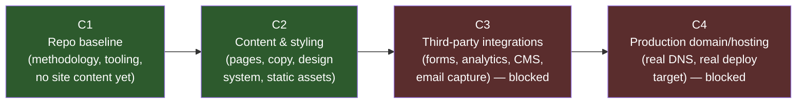

# AGENTS.md — Skilleate landing page

Single source of truth for how work happens in this repo. Any
tool-specific entry point (`CLAUDE.md`, etc.) imports this file rather
than duplicating it.

## 1. One-sentence summary

`main` is the only long-lived branch (trunk-based). Every non-trivial
change first goes through an **OpenSpec proposal** (spec + design +
tasks, no code) reviewed and merged in its own PR, and only
**afterward** gets implemented on a second, separate branch/PR. An
explicit **gate** blocks any change that touches real credentials,
live infrastructure, or capabilities outside today's authorized scope.

Trivial change (typo, copy tweak, formatting) may skip the proposal —
see §3.0.

## 2. Full flow

```mermaid
flowchart TD
    Idea["Idea / bug / request"] --> Trivial{"Trivial?\n(typo, copy,\nformatting)"}
    Trivial -->|yes| DirectPR["Single PR to main\n(no proposal needed)"]
    Trivial -->|no| Gate{"Requires a gate\nnot authorized today?\n(C3/C4, see section 4)"}
    Gate -->|yes| Stop["STOP.\nEscalate for approval.\nDo not implement."]
    Gate -->|no| PropBranch["git checkout -b\nproposal/<change-id>\nfrom main"]
    PropBranch --> Propose["openspec CLI /\n/opsx:propose <change-id>\n-> proposal.md + delta specs"]
    Propose --> Design["design.md\n(decisions, alternatives, risks)"]
    Design --> Refine["Design refinement\n(2nd pass, mandatory if\ntouches C3/C4 surface)"]
    Refine --> Tasks["tasks.md checklist\nopenspec validate"]
    Tasks --> Issue["Tracking issue\n(1 per change)"]
    Issue --> PropPR["PR: proposal/<change-id> -> main\n(OpenSpec artifacts only,\nzero code)"]
    PropPR --> Review1{"Proposal\napproved?"}
    Review1 -->|changes requested| Design
    Review1 -->|yes| MergeProp["Merge proposal PR"]
    MergeProp --> FeatBranch["git checkout -b\nfeat/<change-id>\nfrom main"]
    FeatBranch --> Implement["Implement tasks.md\n(code + tests)"]
    Implement --> LocalCheck["typecheck / build\ntest suite"]
    LocalCheck --> RealCred{"Touches a real\ncredential, host,\nor live infra?"}
    RealCred -->|yes| StopPoint["STOP: request explicit\ngo-ahead before touching\nanything real"]
    StopPoint --> LiveVerify
    RealCred -->|no| LiveVerify["Live verification\n(rendered page, real\nbrowser check, not just\nunit tests)"]
    LiveVerify --> ImplPR["PR: feat/<change-id> -> main\n(links tracking issue +\nopenspec/changes/<change-id>/)"]
    ImplPR --> Review2{"Implementation\napproved?"}
    Review2 -->|changes requested| Implement
    Review2 -->|yes| MergeFeat["Merge implementation PR"]
    MergeFeat --> Archive["openspec archive <change-id> --yes\ncommit + push"]
    Archive --> CloseIssue["Close tracking issue"]
```

**Hard rule:** two branches, two PRs, per non-trivial change — never a
single PR, never skip the proposal. `proposal/<change-id>` (design
review, zero code) merges first; `feat/<change-id>` (implementation)
starts only after that merge.

## 3. Numbered steps

0. **Trivial-change check.** Typo fix, copy edit, formatting-only
   change with no behavioral/visual-system impact? Skip straight to a
   single PR against `main`. Anything else follows steps 1–15.
1. **Proposal.** State the idea in plain language. Optional: explore
   the approach first (`/opsx:explore`) if it's not obvious yet.
2. **Proposal branch.** `git checkout -b proposal/<change-id>` from
   `main`, only now. `<change-id>` is kebab-case; it's reused later in
   `feat/<change-id>`.
3. **Analysis + specs.** On `proposal/<change-id>`, run
   `/opsx:propose <change-id>` (or the `openspec` CLI directly).
   Generates `openspec/changes/<change-id>/proposal.md` + delta
   `specs/` (Given/When/Then scenarios, RFC 2119 keywords). Validate
   with `openspec validate <change-id>`.
4. **Design.** `design.md`: technical approach, decisions, rejected
   alternatives (with explicit reason), risks/trade-offs. Specs stay
   behavior-only — the "how" lives in `design.md`, not in the specs.
5. **Design refinement.** Second pass before locking `tasks.md`.
   **Mandatory** for any change touching gate C3 or C4 (third-party
   integrations, production domain/hosting).
6. **Tasks.** `tasks.md`: checklist under headers
   `## N. <Task Group Name>`, items `- [ ] N.M <task>`. Re-validate.
7. **Tracking issue.** One issue per change (`gh issue create`),
   linked from `proposal.md`.
8. **Proposal PR.** Push `proposal/<change-id>`, open a PR against
   `main` containing **only** `openspec/changes/<change-id>/` (zero
   source-code changes). This is where the proposal itself is
   reviewed and approved.
9. **Merge the proposal.** Once approved, merge into `main`.
10. **Feature branch.** Only after the proposal merge:
    `git checkout -b feat/<change-id>` from `main`.
11. **Implementation.** Work through `tasks.md` on `feat/<change-id>`.
12. **Local validation.** Build/typecheck (once a stack exists) +
    test suite, plus real verification (see section 5).
13. **Implementation PR.** Links the tracking issue and the
    `openspec/changes/<change-id>/` folder.
14. **Merge.**
15. **Archive.** `openspec archive <change-id> --yes`, commit, push,
    then live verification before closing the tracking issue.

## 4. Gate system (phased authorization)

Every new capability belongs to an explicit gate. A change that
requires a gate not authorized today **stops and escalates** — it is
never implemented by inference or "while we're at it."

- **Green (C1, C2) = authorized and shippable today.** Picking a
  stack, building pages, styling, content, local dev tooling.
- **Red (C3, C4) = do not implement without a separate, later
  approval.** Wiring a form to a real backend/email service,
  analytics scripts that phone home, CMS connections, buying/pointing
  a real domain, deploying to a real production host. Any of these
  first requires an explicit go-ahead recorded in the proposal (or, if
  discovered mid-implementation, a stop + escalation before touching
  anything real).

This table is the source of truth for the current gate — not the
generic template in any external methodology doc.

## 5. Verification (what counts as "done")

- **Bug fix:** reproduce, fix, confirm the reproduction no longer
  triggers.
- **New page/component:** smoke-test by rendering it (dev server or
  static file in a real browser), not just "the code compiles."
- **Design/UI change:** visual confirmation (screenshot or live
  browser check) against the design system tokens — see the
  `designer` agent's self-review step in `.omp/agents/designer.md`.
- **C3 integration change:** verify both the success and failure path
  with real test credentials before it's considered done — never
  assume the happy path alone is sufficient.
- Run the project's build/typecheck + test suite **before**
  considering any change touching source code finished (once a stack
  exists; today there is none).
- Change touching a real credential/host/infra → explicit stop for a
  go-ahead before touching anything real; proposal approval alone
  never authorizes that step.

## 6. Repo conventions

- Stack: not yet chosen. The first proposal that adds real site code
  states and justifies the stack in its `design.md`.
- Design system: token-first. See `tokens/`, `components/`,
  `accessibility/`, `taste/` (installed design-skill kit) and
  `.omp/agents/designer.md` (project override of the `designer`
  subagent) for the mandatory token → component → page composition
  order and the anti-slop/accessibility bar.
- Never commit secrets; extend `.env.example` when a stack introduces
  required variables.
- Never log a full token/credential — identifiers only.
- No unauthenticated mutation path once C3 introduces any backend
  integration; default posture until then is fully static/read-only.

## 7. Review standard

See `REVIEW.md` for the full checklist (hard blocks, required checks,
judgment calls, human-only decisions, and the staged path toward
autonomous review). `REVIEW.md` is also distributed as an installable
skill at `.agents/skills/review-pr/SKILL.md` and
`.claude/skills/review-pr/SKILL.md`.

## 8. Where each piece lives

- `AGENTS.md` — this file, full source of truth.
- `CLAUDE.md` — one-line shim importing this file via `@AGENTS.md`,
  plus the design-skill kit's own routing notes.
- `CONTRIBUTING.md` — condensed, PR-oriented version of the workflow.
- `REVIEW.md` — full review standard + installable skill.
- `openspec/config.yaml` — context and per-artifact rules for the
  OpenSpec tooling.
- `openspec/changes/archive/` — history of already-implemented,
  archived changes.
- `.github/CODEOWNERS` — current human reviewer(s).
