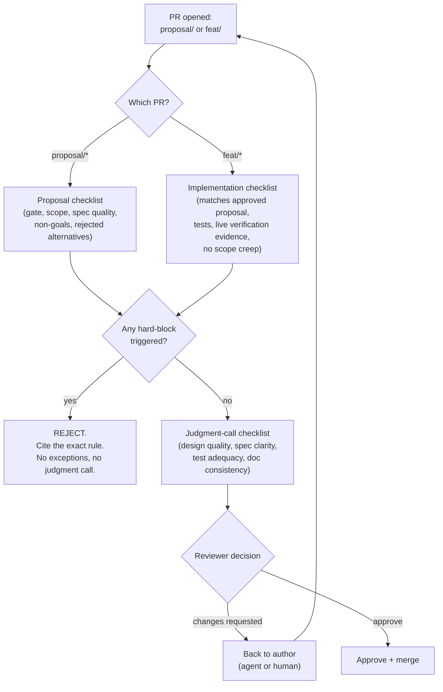

# Review standard

The goal is not "a human eventually approves this." The goal is a
standard precise enough that an AI agent could execute it today,
verify against the same objective criteria, and produce the same
accept/reject decision a careful human would — for everything except
the judgment calls explicitly reserved for a human (§4).

This standard is also distributed as an installable skill at
`.agents/skills/review-pr/SKILL.md` and
`.claude/skills/review-pr/SKILL.md` (identical content).

## 1. Hard blocks — reject immediately, no exceptions

- The proposal explicitly names the gate it belongs to (C1/C2/C3/C4,
  see `AGENTS.md` §4) and that gate is authorized today. Reject if it
  requires C3/C4 without a separate, already-recorded approval.
- Zero credentials, private keys, `.env` values, or tokens anywhere in
  the diff.
- Zero reuse of an existing named human's identity/credential for a
  new automated path — a machine-driven path never shares credentials
  with a human operator.
- Zero tool/mode/parameter that accepts arbitrary shell commands,
  unrestricted exec, or an open-ended API surface — every operation
  must be a fixed, enumerated mode.
- Zero mutating operation on any live/external target without a
  separate, explicit approval recorded in the proposal (default
  posture: read-only / static-only until C3 is authorized).
- Clean build/typecheck, zero errors (once a stack exists).
- Clean test suite, zero failures (once a stack exists).
- Clean `openspec validate --all`, zero failures.
- A `feat/<id>` PR requires its `openspec/changes/<id>/` to have
  already been merged via its own `proposal/<id>` PR — introducing
  unreviewed specs in the same implementation PR is a process
  violation, not a shortcut.
- A `proposal/<id>` PR contains **zero** implementation code (zero
  changes outside `openspec/changes/<id>/`) — proposal and
  implementation are always separate PRs.

## 2. Required, checked but not always fatal alone

- `proposal.md` states the gate and has a `## Tracking Issue` line
  (once the issue exists).
- Every new capability states its exact allowlisted operation set in
  `design.md` — no "future" carve-out for open-ended execution.
- Every new integration (once C3 is authorized) states the exact
  scope(s)/permissions it requires.
- `design.md` documents at least one rejected alternative with a
  reason, for any change touching C3/C4.
- `tasks.md` has a checklist item for every capability `design.md`/the
  delta specs describe, and the PR's actual diff matches what's
  checked (nothing checked without being implemented, nothing
  implemented without being checked).
- Every behavioral change ships with a new/updated test that fails
  without the fix/feature and passes with it — not a test that would
  pass unconditionally (once a stack/test framework exists).
- Any PR whose `tasks.md` includes a real-credential/real-host step
  explicitly documents, in the PR description, whether that step was
  executed and by whom.
- If new commits complete a `tasks.md` group previously described as
  "not done" or "deliberately deferred," the PR description is updated
  in the same review cycle.
- Any edit to a PR's stated title/description/scope is accompanied by
  a comment summarizing what changed and why — append-only
  traceability record (descriptions are mutable and lose history on
  edit; comments don't).
- A 1-3 line comment is the floor, not the ceiling. When the change
  carries real technical weight (a design decision, a rejected
  alternative, a security/data-handling trade-off), the comment goes
  into full technical detail — transparency over brevity whenever the
  two conflict.
- The PR description states: what changed, why, which gate it belongs
  to, security/data-handling impact, checks performed, rollback
  approach.

## 3. Judgment-call checklist (human-reasoned today)

Requires weighing trade-offs, not just checking a box. Document the
reasoning in the review comment, not just the verdict:

- Is the chosen design the right one for the project's constraints
  (marketing-site scope, no backend yet, small team), or does
  `design.md` paper over a simpler alternative that should have won?
- Do the delta specs' Given/When/Then scenarios actually cover the
  behavior that matters, or do they just restate the implementation?
- Is test/verification coverage proportionate to risk — does the
  riskiest path (any future C3 integration, anything touching real
  infra) get the most scrutiny, not just the easiest-to-test path?
- Does the PR's stated non-goals list match what a careful reading of
  the diff confirms is actually out of scope, or is there quiet scope
  creep the author didn't call out?
- Does the change plausibly weaken any accessibility or design-system
  consistency guarantee the installed design-skill kit's gates already
  enforce (token drift, contrast regression, missing states)? If
  genuinely unsure, treat it as a hard block and escalate rather than
  approve.

## 4. What stays human-only, for now

Regardless of how capable an autonomous reviewer becomes, these
decisions require sign-off from a named, accountable human (see
`.github/CODEOWNERS`):

- Approving a proposal that requests a new gate or expands what an
  already-authorized gate (C1/C2) covers into C3/C4 territory.
- Granting an exception to a hard-block criterion.
- Approving anything that provisions, rotates, or revokes a real
  credential, SSH key, DNS record, or host-level access.
- Changing this document, `AGENTS.md`, or the code owners file.

## 5. Path to autonomous review (staged, not "someday it flips on")

1. **Today — human review, checklist-assisted.** The human reviews
   every PR against this checklist. The checklist itself is refined
   whenever a review catches something it didn't already ask about —
   every miss becomes a new checklist line, not an undocumented
   one-off judgment call.
2. **Shadow mode.** An autonomous agent reviews every PR in parallel
   with the human, posting its own verdict as a comment, but never
   blocking or approving. Agreement is compared over an agreed minimum
   run before moving on.
3. **Hard-block authority only.** Once shadow-mode agreement on hard
   blocks is consistently 100% (any false negative restarts this
   stage), the agent may autonomously reject on a hard-block
   violation. It still cannot approve — that still requires a human.
4. **Full authority within the judgment-call checklist, one gate at a
   time.** The agent may approve routine, low-risk changes (docs,
   content, styling that doesn't touch C3/C4) within an
   already-authorized gate. Anything touching a new/expanded gate
   always routes to the human — permanently, not a stage that later
   gets removed.
5. **Review at any stage is revoked, not paused, on a single confirmed
   miss** of a hard-block criterion. Stage regression is the default
   response to a false approval, not an exception.

No stage transition happens by assumption — each one requires an
explicit decision recorded the same way a gate change is: written
down, attributed, and dated.

**Current stage: 1 (human review, checklist-assisted).**
